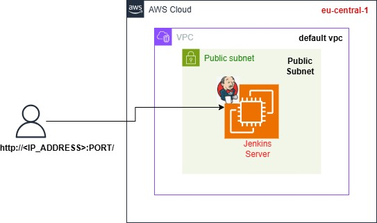
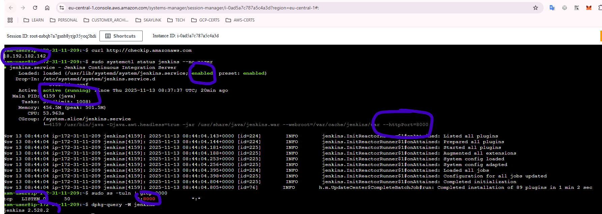
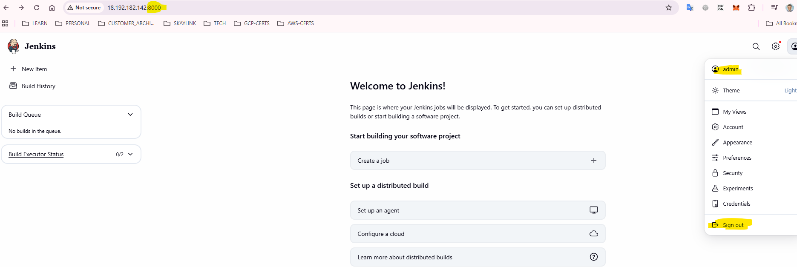
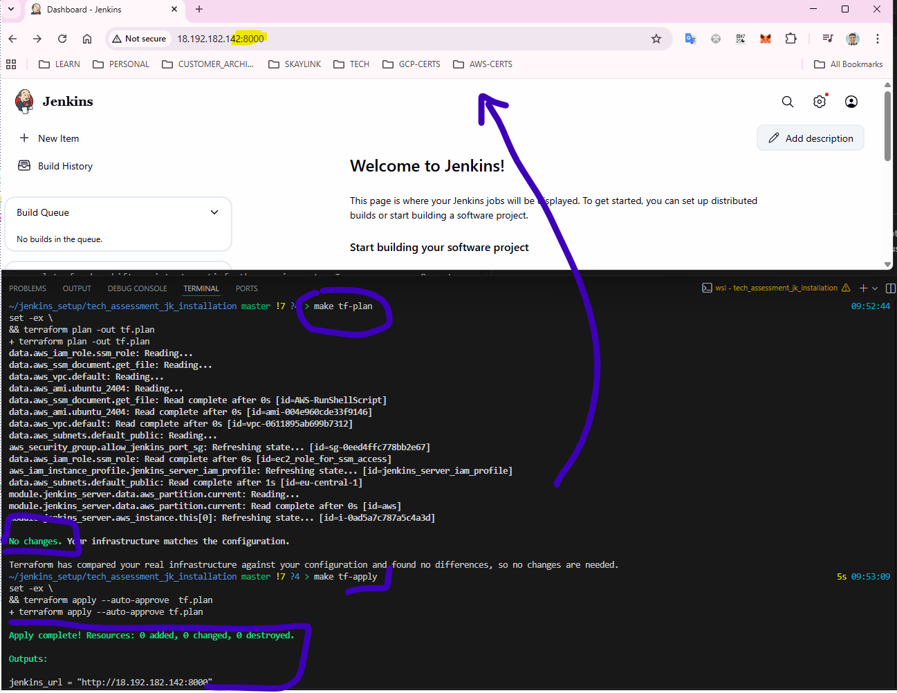
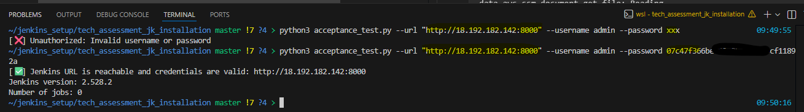

<h1 align="Center"> Technical Challenge Assignment </h1>

**Author** : [Vasudeva Nayak Kukkundoor](https://www.linkedin.com/in/vazudew/)

As part of Interview process, I am given a technical assigment, as defined in the [document](assignment.md) 

The objective of the challenge is to prepare a mechanism to install/configure Jenkins Server, without any errors, and with no manual efforts.

## Table of Content
* [Final Details](#fin)
* [Some Thoughts on Requirements](#reqs)
* [Design Considerations](#cons)
    + [Approach](#app)
    + [Infrastructure](#infra) 
    + [Jenkins Setup and Automation](#conf) 
    + [Out-of-Scope](#oos)
* [Solution](#sol)
    + [Assumptions](#ass) 
    + [Architecture](#arch)
    + [Execution](#exec)
* [Results](#res)
* [Future Scope ](#future)
* [Useful Links](#useful)


## <a name="fin"></a> Final Details
1. [Assignment Document](assignment.md) 
2. [Source Code Link](https://github.com/vazudew/tech_assessment_jk)
3. [Execution Instructions](#exec)
4. [Answers](technical_challenge_assignment_report.pdf)

## <a name="reqs"></a> Some thoughts on Requirements
(a) _The solution must run on a clean installation of the chosen operating system
without errors_

This requirement hints at _IaC_ automation, which expects a script to contain all the commands, configurations to build necessary package, install and setup Jenkins server. Well developed and tested automation increases reviewability, code quality and reduce manual errors. Also not to forget reusability (of course with parameterization) and can support installations, at scale.

(b) _Jenkins and its prerequisites must be installed without manual intervention_

Here I assume prerequisites are installing _java run time_, adding _jenkins repos_/_keys_, and having default _admin_ user. The solution revolves around these tasks, with automation getting deployed.

However for the _Proof-of-Concept_ I exclude _plugins_ installation, additional _users_ creation, and _job/project_ preparation.

(c) _Jenkins must be configured to serve requests over port 8000_

This task is to check specific setting to be done with _jenkins_ service configuration. After some homework, I found that we must prepare an _override.conf_ file for _jenkins_ service containing the Port settings.

(d) _Subsequent applications of the solution should not cause failures or repeat
redundant configuration tasks_

This requirement orients towards [_Idempotency_](https://www.dremio.com/wiki/idempotency/) and thus we need to have a state stored solution. That is, we need to ensure, multiple execution of the solution (with no changes in the code), lead to same output. Thus the solution, despite subsequent execution, lets the system be intact and does not repeat any task, which are already completed. 

However changes in the source code implies change in desired state and execution of the solution, would result in new desired state of the system. This feature is very important as it a) reduces deployment time, b) maintains always desired state of system, and c) reduces errors increasing code quality.

**Success Criteria**

* successful exeuction of solution, deploys jenkins server, configures the application without any errors
* subsequent execution of solution (without the code change), results in no change in the deployment
* change in the code, and execution of solution, implies new deployment which must take place and system gets updated
* Jenkins Portal is accessible on _HTTP Port_ 8000, directly via IP address of compute instance
* User can login in as _admin_ user (pre-configured), however needs to retrieve and use *admin_password* manually


## <a name="cons"></a> Design Considerations

### <a name="app"></a> Approach
* ideate components of solution to be accurate, automatable and fast to deployment
* _PoC_ mentality, focussing just on functionality and bare minimum security aspects 
* automate as much as possible, provide debug/troubleshooting if needed
* the Solution must be sharable with wider audience, for review, and evaluation

### <a name="infra"></a> Infrastructure
* AWS Cloud, EC2 Instance (Ubuntu 22.04) deployed on Public Subnet under _default_ VPC
* Cloud Native Services such as _IAM_, _CloudWatch_, _AWS System Manager_ (for easy management of EC2 instances), _Security Group_ (allowing only HTTP Port for _Jenkins_)
* Operating System Tested (VERSION="24.04.3 LTS (Noble Numbat)")
* exclude Container/Pod setup, as they usually come with _images_ preconfigured with all attributes. May not be suitable for the accomplishment of this task, which needs to install the jenkins on _clean_ system.

### <a name="conf"></a> Jenkins Setup and Automation
* First thought I had was to go with _Golden Images_ for _EC2_ or _Container_ Instances. This is common pattern amongst _Cloud Engineers_. With this pattern, we prepare a compute instance, deploy every relevant software/configurations needed and then create a _standard image_ (or _Golden Image_) out of it, which can be used at scale. However this pattern does not satisfy _requirement (a)_ and hence is shelved.
* We need to stick to a mechanism, where user can describe a desired state (_declarative approach_) of the system. This helps in achieving _idempotent_ automation. My preferred automation tool _Terraform_ does not have _jenkins_ installers out of the box. So _Terraform_ script alone cannot help prepare the solution, expecially _requirement(a)_, and _requirement(c)_
* A set of commands to install and configure _jenkins_ can be prepared as a _bash_ script. However, executing this _bash_ script alone may not be a good idea, as subsequent execution of the script, does not satisfy _requirement (d)_.
* A combination of _Terraform_ Script and _bash_ script can make us achieve _requirement (d)_. Making the _bash_ script to execute _jenkins installer_ as part of *User_Data* in the EC2 Instance. Once the EC2 instance is created, subsequent execution of script, does not change the system, until the _bash_ script is changed! Therefore combination of _Terraform_ Script and _bash_ script can then achieve all the requirements mentioned above. 
* Preferred Automation Stack:
    1. Iac - Terraform
    2. Terraform standard modules (_terraform-aws-modules/ec2-instance/aws_)
    3. Jenkins installation script as bash file 
    4. AWS Cloud Provider

### <a name="oos"></a>Out of Scope
Following concepts are not considered for the solution, for the benefit of time
1. _High Availability_ of Jenkins Servers ( active/passive setup)
2. _Security in Depth_ : we launched Jenkins server on _Public_ subnet not behind _ALB_, however we allow *only* inbound on port 8000
3. _Data Backup_ and _Disaster Recovery_
4. Advanced Jenkins Setup and confirguration, all are as per _Success Criteria_ mentioned above in [Some Thoughts on Requirements](#reqs) section

## <a name="sol"></a> Solution 

### <a name="ass"></a> Assumptions
1. The server would be hosted in _default_ VPC, and a Publich subnet with a specific tag {function=dev}. This is to ensure EC2 is deployed and can be accessible by internet. You may have to change the code, accordingly for your execution.

2. The Jenkins server would be running on EC2, with Ubuntu 2404 Server, containing already _AWS SSM Agent_ installed. Other OSes, Flavours are not tested and out of scope.

3. I use a pre-configured SSM Role, which will be set with _Instance Profile_ for the EC2 _Jenkins Server_. The Role would contain _AWS Managed Permissions_ such as _AmazonSSMManagedInstanceCore_, _AmazonEC2RoleforSSM_, and _CloudWatchLogsFullAccess_.This role enables EC2 Instance (_Jenkins Server_) to be managed directly by _AWS System Manager_ for further operations.ou may have to change the code, accordingly for your execution.

4. The EC2 Instance hast just one _Security Group_ atatched, to allow inbound traffic from anywhere (0.0.0.0/0) for the only *Jenkins_Port*. Please excercise caution, here as it is not a right way to secure workload. 

5. As the _Security Group_ does not allw _SSH_ connection onto EC2 machine, I use _Session Manager_ to connect.

6. The *jenkins_installer.sh* installs latest _Jenkins_ (Version: "2.528.1") binary on to the machine. For additional installation, this script must be updated.

7. By default _Jenkins_ creates an *admin* user with password stored in the file _/var/lib/jenkins/secrets/initialAdminPassword_. The content of this file has to be fetched to access _Jenkins_ GUI Portal.

8. For the benefit of time, I have considered minimalistic approach to focus on completion of task. 


## <a name="arch"></a> Architecture 

This is the reference architecture on AWS Cloud. As mentioned in the Assumptions section, we deploy the Jenkins Server in a public subnet, in _defualt_ VPC in the _Frankfurt_ Region (_eu-central-1_).

After successful deployment, any user can access the _jenkins_ server with the URL (_http://<Public_IP_Jenkins_Server>:<Jenkins_Port>/_)

 <br />

### <a name="exec"></a> Execution

In this section, we discuss how to prepare your machine, to deploy the solution presented in this repository. 

Several _Makefile_ commands are prepared, for easy execution

1. download the latest project code repo onto your machine
    ```bash
    $ git clone <URL_OF_THIS_REPO>
    ```
2. Please look at the file _data.tf_ and see various *sources* those are pre-configured for the solution (also mentioned in Assumptions section). Prepare similar _AWS Resources_ on your Cloud Platform. Modify this file accordingly.

3. Please modify the _backend_ section of _config.tf_ to prepare, store the state files.

4. Prepare right AWS Credentials, as Terraform needs to communicate with AWS Account with your credentials

5. run `make tf-init` to initialize terraform 
```bash                                                                    
set -ex \
&& terraform init
+ terraform init
Initializing the backend...
Initializing modules...
Initializing provider plugins...
...
Terraform has been successfully initialized!
...
commands will detect it and remind you to do so if necessary.
```

6. execute `make tf-plan` to get holistic view about deployment plan
```bash
set -ex \
&& terraform plan -out tf.plan
+ terraform plan -out tf.plan
data.aws_iam_role.ssm_role: Reading...
data.aws_ssm_document.get_file: Reading...
data.aws_vpc.default: Reading...
..
Plan: 3 to add, 0 to change, 0 to destroy.

Changes to Outputs:
  + jenkins_url = (known after apply)
---

Saved the plan to: tf.plan
```

7. Once you review the plan, and are satisfied, we can move to deployment of solution. Please run `make tf-apply` command.
```bash
aws_iam_instance_profile.jenkins_server_iam_profile: Creating...
aws_security_group.allow_jenkins_port_sg: Creating...
aws_security_group.allow_jenkins_port_sg: Creation complete after 1s [id=sg-0ca4824b4cbaa785a]
aws_iam_instance_profile.jenkins_server_iam_profile: Creation complete after 5s [id=jenkins_server_iam_profile]
module.jenkins_server.data.aws_partition.current: Reading...
module.jenkins_server.data.aws_partition.current: Read complete after 0s [id=aws]
module.jenkins_server.aws_instance.this[0]: Creating...
module.jenkins_server.aws_instance.this[0]: Still creating... [00m10s elapsed]
module.jenkins_server.aws_instance.this[0]: Creation complete after 15s [id=i-0f9a9ee779f9d47b0]

Apply complete! Resources: 3 added, 0 changed, 0 destroyed.

Outputs:

jenkins_url = "http://18.196.90.186:8000"
```
8. Please fetch the admin user password by logging into the EC2 instance using _AWS Session Manager_. The password will be the content of file _/var/lib/jenkins/secrets/initialAdminPassword_

9. You can also use *acceptance_test.py* script that is shipped with this repo, for ensuring the jenkins in fact is accessible, with *admin* user.
```bash
python3 acceptance_test.py --url "http://<Public_IP_Jenkins_Server>:<Jenkins_Port>/" --username admin --password <ADMIN_PASSWORD>
[✅] Jenkins URL is reachable and credentials are valid: http://18.192.182.142:8000
Jenkins version: 2.528.2
Number of jobs: 0
```

9. Please run `make tf-destroy` to remove entire deployment. Exercise caution, while doing so, as there is no _Backup_, or _Disaster Recovery_ strategies in place.
```bash
data.aws_ssm_document.get_file: Reading...
data.aws_vpc.default: Reading...
data.aws_iam_role.ssm_role: Reading...
data.aws_ami.ubuntu_2404: Reading...
...
ws_iam_instance_profile.jenkins_server_iam_profile: Destroying... [id=jenkins_server_iam_profile]
aws_security_group.allow_jenkins_port_sg: Destroying... [id=sg-0ca4824b4cbaa785a]
aws_security_group.allow_jenkins_port_sg: Destruction complete after 1s
aws_iam_instance_profile.jenkins_server_iam_profile: Destruction complete after 1s

Destroy complete! Resources: 3 destroyed.
```
## <a name="res"></a> Results

Here are some of the screenshots of accomplishments.

1. _Jenkins_ Installed EC2 instance and configured to listen on _TCP_ Port *8000* 
 <br />

2. _Jenkins_ Portal ready to login, need to fetch the *admin* password
 <br/>

3. _Jenkins_ Portal logged as *admin* 
 <br/>

4. Executing multiple times, implies no change in the system.
 <br/>

5. Test Script to validate acceptance criteria
 <br/>

## <a name="future"></a> Future Scope 

1. The solution is however not completely _declarative_ in nature. We make use of lot of make-shift scripts to satisfy the requirements. I am very sure _Puppet_ can support this use case, very elegantly. 

2. The solution prepared on the context of AWS Cloud, Ubuntu speficific platforms. There must be a general solution, which can cater to the requirements.

3. Principles of [_Well Architected Framework_](https://docs.aws.amazon.com/wellarchitected/latest/framework/the-pillars-of-the-framework.html) must be implemented for better resiliency, operation excellence and governance.


## <a name="useful"></a> Useful Links
| **Sl. No.** | **Link** | **Remarks** |
----------|--------------|--------------
| 1| [Official Jenkins Installation](https://www.jenkins.io/doc/book/installing/linux/#debianubuntu) | _bash_ script to install pre-requisites, jenkins binaries |
|2| [Jenkins Port Setup](https://www.jenkins.io/doc/book/installing/initial-settings/)| Jenkins configurations and options |
|3|[_override.conf_ nuances in Jenkins](https://www.jenkins.io/blog/2022/03/25/systemd-migration/) | Understanding parameter changes in Jenkins|
|4| [_AWS System Manager_](https://docs.aws.amazon.com/systems-manager/latest/userguide/systems-manager-setting-up-ec2.html) | Basics on EC2 config management AWS Style|
|5| [_AWS System Manager Runbook_](https://docs.aws.amazon.com/systems-manager/latest/userguide/automation-documents.html)| executing _Run_ Commands on managed EC2 instances |
|6|[_AWS EC2 User Data_](https://docs.aws.amazon.com/pcs/latest/userguide/working-with_ec2-user-data.html) | Ground work for EC2 user data and scripts |
|7| [_Hashicorp Terraform Documentation_](https://registry.terraform.io/providers/hashicorp/aws/latest/docs/resources/instance.html)| Documentation for various _AWS_ resource creation|
|8|[Terraform EC2 Module](https://github.com/terraform-aws-modules/terraform-aws-ec2-instance) | easy to use, tested modules for fast deployment |
|9| [Puppet Introduction](https://www.puppet.com/why-puppet/use-cases/continuous-configuration-automation)| Basic understanding of _Puppet_ works|
|10| [ChatGPT](https://chatgpt.com/)| Quicker syntax free code samples |